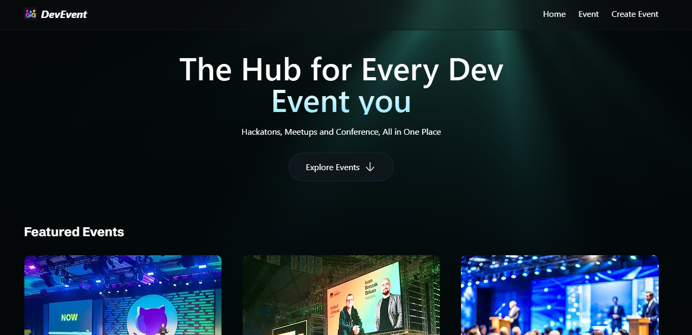
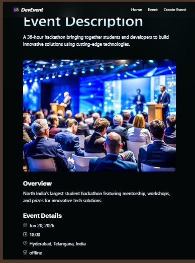
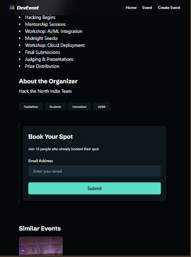

# 🚀 DevEvents — Developer Events Platform

A modern, full-stack web application built with **Next.js 16** that helps developers discover, explore, and share tech events from around the world.

---

## 📌 Table of Contents

- [Overview](#overview)
- [Features](#features)
- [Tech Stack](#tech-stack)
- [Project Structure](#project-structure)
- [Getting Started](#getting-started)
- [Environment Variables](#environment-variables)
- [API Routes](#api-routes)
- [Roadmap](#roadmap)
- [Contributing](#contributing)
- [License](#license)

---

## 🌐 Overview

**DevEvents** is a platform designed specifically for the developer community. Users can browse upcoming tech conferences, hackathons, workshops, and meetups. Clicking on any event image takes you to a detailed event page, and the platform surfaces similar events to help users discover more of what they love.

---

## ✨ Features

- 🗂️ **Browse Dev Events** — View a curated list of developer events (conferences, hackathons, workshops, meetups).
- ➕ **Add Events** — Submit new events to the platform with image upload support.
- 🖼️ **Event Detail Page** — Click on any event image to see full event details including date, location, description, and organizer info.
- 🔍 **Similar Events** — Each event detail page surfaces related events based on category or tags.
- ☁️ **Image Storage via Cloudinary** — All event images are stored and optimized using Cloudinary.
- 📱 **Responsive Design** — Fully responsive UI built with Tailwind CSS.
- ⚡ **Smooth Animations** — Micro-interactions and icons powered by Lucide React.

---

## 🛠️ Tech Stack

| Technology | Purpose |
|---|---|
| [Next.js 16](https://nextjs.org/) | Full-stack React framework (App Router) |
| [React.js](https://react.dev/) | UI component library |
| [TypeScript](https://www.typescriptlang.org/) | Type safety across the codebase |
| [MongoDB](https://www.mongodb.com/) | NoSQL database for storing event data |
| [Cloudinary](https://cloudinary.com/) | Cloud-based image storage and optimization |
| [Tailwind CSS](https://tailwindcss.com/) | Utility-first CSS framework |
| [Lucide React](https://lucide.dev/) | Icon library for UI animations and iconography |

---

## 📁 Project Structure

```
EVENT_MANAGER/
├── .next/                          # Next.js build output (auto-generated)
│
├── app/
│   ├── api/
│   │   └── events/
│   │       ├── [slug]/
│   │       │   └── route.ts        # GET single event by slug
│   │       └── route.ts            # GET all events, POST new event
│   ├── events/
│   │   └── [slug]/
│   │       └── page.tsx            # Event detail page (similar events included)
│   ├── favicon.ico                 # App favicon
│   ├── globals.css                 # Global Tailwind / base styles
│   ├── layout.tsx                  # Root layout with Navbar, fonts, metadata
│   └── page.tsx                    # Homepage — hero + events listing
│
├── components/                     # App-level shared components (Navbar, Footer, etc.)
│
├── components/                     # Feature-level components (EventCard, SimilarEvents, etc.)
│   ├── EventCard.tsx               # Event card with image click → detail page
│   ├── EventGrid.tsx               # Grid layout for event cards
│   ├── EventDetail.tsx             # Full detail view of a single event
│   ├── SimilarEvents.tsx           # Similar events section on detail page
│   └── AddEventForm.tsx            # Form to submit a new event
│
├── database/                       # MongoDB connection & Mongoose models
│   ├── connection.ts               # MongoDB connection utility (mongoose)
│   └── models/
│       └── Event.ts                # Mongoose schema/model for Event
│
├── lib/                            # Utility / helper functions
│   ├── cloudinary.ts               # Cloudinary config and upload helpers
│   └── utils.ts                    # General utility functions (slugify, format dates, etc.)
│
├── node_modules/                   # Installed dependencies (auto-generated)
│
├── public/
│   ├── icons/                      # SVG / PNG icons used across the app
│   └── images/                     # Static images (fallback, placeholder, etc.)
│
├── .env.local                      # Environment variables (not committed)
├── next.config.ts                  # Next.js configuration
├── tailwind.config.ts              # Tailwind CSS configuration
├── tsconfig.json                   # TypeScript configuration
└── package.json                    # Project dependencies and scripts
```

---

## 🚀 Getting Started

### Prerequisites

Make sure you have the following installed:

- [Node.js](https://nodejs.org/) v18 or higher
- [npm](https://www.npmjs.com/) or [yarn](https://yarnpkg.com/)
- A [MongoDB](https://www.mongodb.com/atlas) database (local or Atlas)
- A [Cloudinary](https://cloudinary.com/) account

### Installation

1. **Clone the repository**

```bash
git clone https://github.com/your-username/devevents.git
cd devevents
```

2. **Install dependencies**

```bash
npm install
# or
yarn install
```


4. **Run the development server**

```bash
npm run dev
# or
yarn dev
```

5. **Open the app**

Visit : https://dev-event-hub-khaki.vercel.app/





---

## 🔐 Environment Variables

Create a `.env.local` file in the root of your project and add the following:

```env
# MongoDB
MONGODB_URI=mongodb+srv://<username>:<password>@cluster.mongodb.net/devevents

# Cloudinary
CLOUDINARY_CLOUD_NAME=your_cloud_name
CLOUDINARY_API_KEY=your_api_key
CLOUDINARY_API_SECRET=your_api_secret

# App
NEXT_PUBLIC_BASE_URL=http://localhost:3000
```

> ⚠️ Never commit `.env.local` to version control. It is already included in `.gitignore`.

---

## 📡 API Routes

| Method | Endpoint | Description |
|---|---|---|
| `GET` | `/api/events` | Fetch all events |
| `POST` | `/api/events` | Create a new event |
| `GET` | `/api/events/:id` | Fetch a single event by ID |


---

## 🗺️ Roadmap

The following features are planned for upcoming releases:

- [ ] **User Authentication** — Sign up / log in with credentials or OAuth (e.g. GitHub, Google) to restrict event creation to verified users.
- [ ] **Event Notifications** — Users can subscribe to events and receive reminders or update notifications via email or in-app alerts.
- [ ] **Advanced Event Filtering** — Filter events by date, category, location, or format (online/in-person).
- [ ] **Event Editing & Deletion** — Allow authenticated event organizers to manage their own events.
- [ ] **User Profiles** — Personal dashboards to manage submitted events and saved events.
- [ ] **Search Functionality** — Full-text search across event titles, descriptions, and tags.
- [ ] **Pagination & Infinite Scroll** — Performance-friendly loading for large event lists.

---


> Built with ❤️ for the developer community.